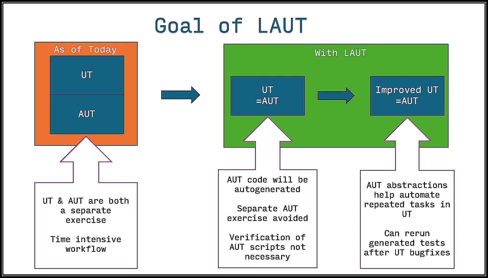

==============================================
Welcome to LAUT's documentation!
==============================================

LAUT is a tool used for network automation.

Getting Started
===============

.. include:: overview/summary.rst

.. toctree::
   :maxdepth: 1
   :hidden:

   overview/index

Commands
========

.. include:: commands/summary.rst

.. toctree::
   :maxdepth: 4
   :includehidden:

   commands/index

Features
========

.. include:: features/summary.rst

.. toctree::
   :maxdepth: 1
   :hidden:

   features/index

