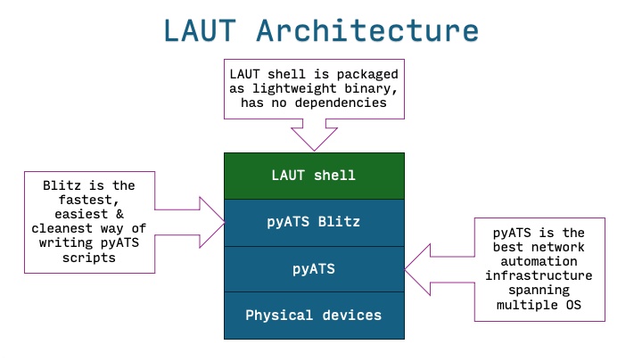
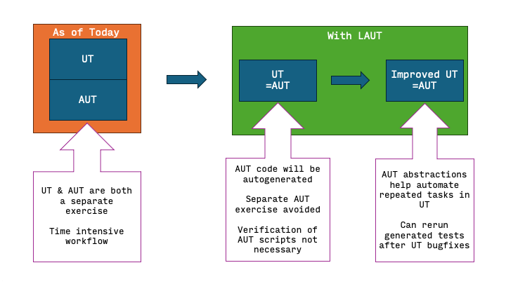
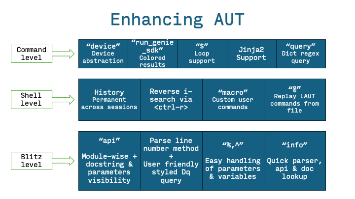

LAUT shell is a tool used for network automation at small scale with device console workflows.
LAUT provides a higher level abstraction interface to interact with these network devices enabling
users to work on a network as if programming a high level language.

Architecture
----------------

Automation script helper
------------------------

It is essential to cover code with automated test cases to prevent it from falling into legacy.
LAUT helps developers write AUT scripts, autogenerating pyATS blitz snippets which are readable,
error-free, easy to understand and modify.

Higher level network abstractions
------------------------------------

Since LAUT is an abstraction interface, it can consider the devices as well as the various
commands it provides to be mere virtualities of what can happen physically. This is particularly
visible by having loops, apis, variables & parameters embedded in its commands thereby enhancing
throughput of network worflows.

LAUT uses pyATS blitz YAML to record each operation performed on a network device and can
simultaneously run previously autogenerated blitz YAML files providing an analogy to that
of functions in high level programming languages. These YAML files can handle anywhere from
a set of configuration that can vary based on parameters to intense verifications on
show command outputs.

